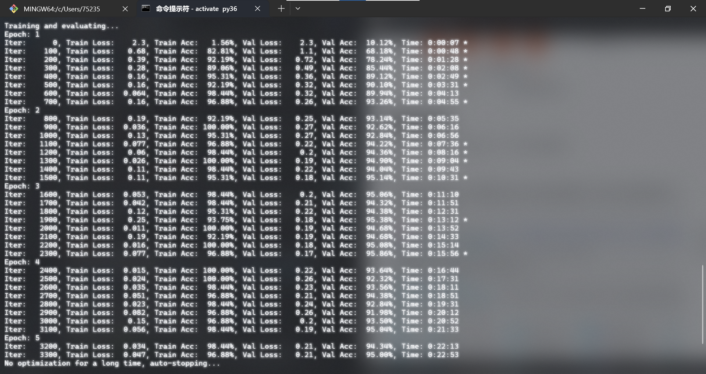
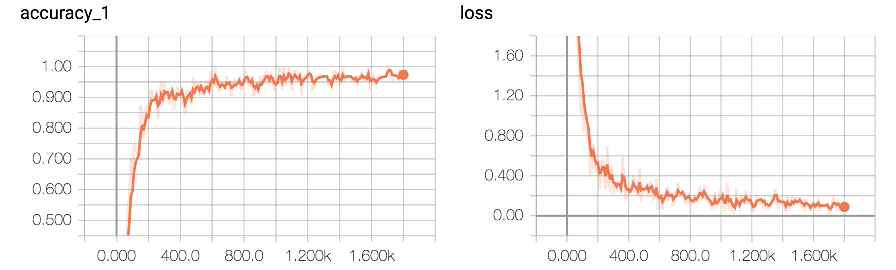
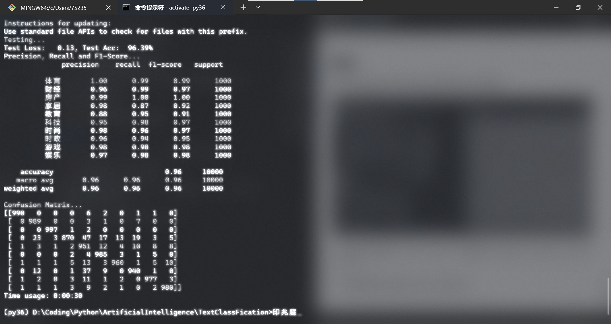

<!-- title: TextClassiFication -->
<!-- author：BryceLoski11 -->
<!-- time：2023/6/1 16:50 -->
<!-- https://github.com/BryceLoski21/TextClassification -->

# 项目说明

使用卷积神经网络进行中文文本分类

此项目基于TensorFlow在中文数据集上的简化实现，使用了字符级CNN对中文文本进行分类，达到了较好的效果。

CNN做句子分类的论文可以参考: [Convolutional Neural Networks for Sentence Classification](https://arxiv.org/abs/1408.5882)

还可以参考dennybritz大牛的博客：[Implementing a CNN for Text Classification in TensorFlow](http://www.wildml.com/2015/12/implementing-a-cnn-for-text-classification-in-tensorflow/)

文中所使用的Conv1D与论文中有些不同，详细参考官方文档：[tf.nn.conv1d](https://www.tensorflow.org/api_docs/python/tf/nn/conv1d)

## 环境

- Python 3.6 (<=3.6)
- TensorFlow 1.13.1 (<2.0)
- numpy
- scipy
- scikit-learn 0.24.2

注意：
> 项目中用到了tensorflow.compat.v1, 而在tensorflow2.0版本及以上中删除了这个组件, 配置环境时需要指定tensorflw版本且python版本不能大于3.6


## 数据集

使用THUCNews的一个子集进行训练与测试，数据集到[THUCTC：一个高效的中文文本分类工具包](http://thuctc.thunlp.org/)进行下载.

本次训练使用了其中的10个分类，每个分类6500条数据。

类别如下：

```txt
体育, 财经, 房产, 家居, 教育, 科技, 时尚, 时政, 游戏, 娱乐
```

数据集划分如下：

- 训练集: 5000*10
- 验证集: 500*10
- 测试集: 1000*10

从原数据集生成子集的过程请参看`helper`下的两个脚本。其中，`copy_data.sh`用于从每个分类拷贝6500个文件，`cnews_group.py`用于将多个文件整合到一个文件中。执行该文件后，得到三个数据文件：

- cnews.train.txt: 训练集(50000条)
- cnews.val.txt: 验证集(5000条)
- cnews.test.txt: 测试集(10000条)

## 预处理

`data/cnews_loader.py`为数据的预处理文件。

- `read_file()`: 读取文件数据;
- `build_vocab()`: 构建词汇表，使用字符级的表示，这一函数会将词汇表存储下来，避免每一次重复处理;
- `read_vocab()`: 读取上一步存储的词汇表，转换为`{词：id}`表示;
- `read_category()`: 将分类目录固定，转换为`{类别: id}`表示;
- `to_words()`: 将一条由id表示的数据重新转换为文字;
- `process_file()`: 将数据集从文字转换为固定长度的id序列表示;
- `batch_iter()`: 为神经网络的训练准备经过shuffle的批次的数据。

经过数据预处理，数据的格式如下：

| Data | Shape | Data | Shape |
| :---------- | :---------- | :---------- | :---------- |
| x_train | [50000, 600] | y_train | [50000, 10] |
| x_val | [5000, 600] | y_val | [5000, 10] |
| x_test | [10000, 600] | y_test | [10000, 10] |

## CNN卷积神经网络

### 配置项

CNN可配置的参数如下所示，在`cnn_model.py`中。

```python
class TCNNConfig(object):
    """CNN配置参数"""

    embedding_dim = 64      # 词向量维度
    seq_length = 600        # 序列长度
    num_classes = 10        # 类别数
    num_filters = 128        # 卷积核数目
    kernel_size = 5         # 卷积核尺寸
    vocab_size = 5000       # 词汇表达小

    hidden_dim = 128        # 全连接层神经元

    dropout_keep_prob = 0.5 # dropout保留比例
    learning_rate = 1e-3    # 学习率

    batch_size = 64         # 每批训练大小
    num_epochs = 10         # 总迭代轮次

    print_per_batch = 100    # 每多少轮输出一次结果
    save_per_batch = 10      # 每多少轮存入tensorboard
```

### CNN模型

主要由5个部分组成：输入层, 卷积层, 激活层, 池化层, 全连接层, 具体看`cnn_model.py`的实现

大致结构如下：


### 训练与验证

运行 `python run_cnn.py train`，可以开始训练。

注意:
> 若之前进行过训练，请把tensorboard/textcnn删除，避免TensorBoard多次训练结果重叠。



在验证集上的最佳效果为95.86%，且只经过了5轮迭代就已经停止。

准确率和误差如图所示：



### 测试

运行 `python run_cnn.py test` 在测试集上进行测试。



在测试集上的准确率达到了96.39%，且各类的precision, recall和f1-score都超过了0.9。

从混淆矩阵也可以看出分类效果非常优秀。

<!-- 恨重叠,重叠恨,恨绵绵,恨满晚妆楼; -->
